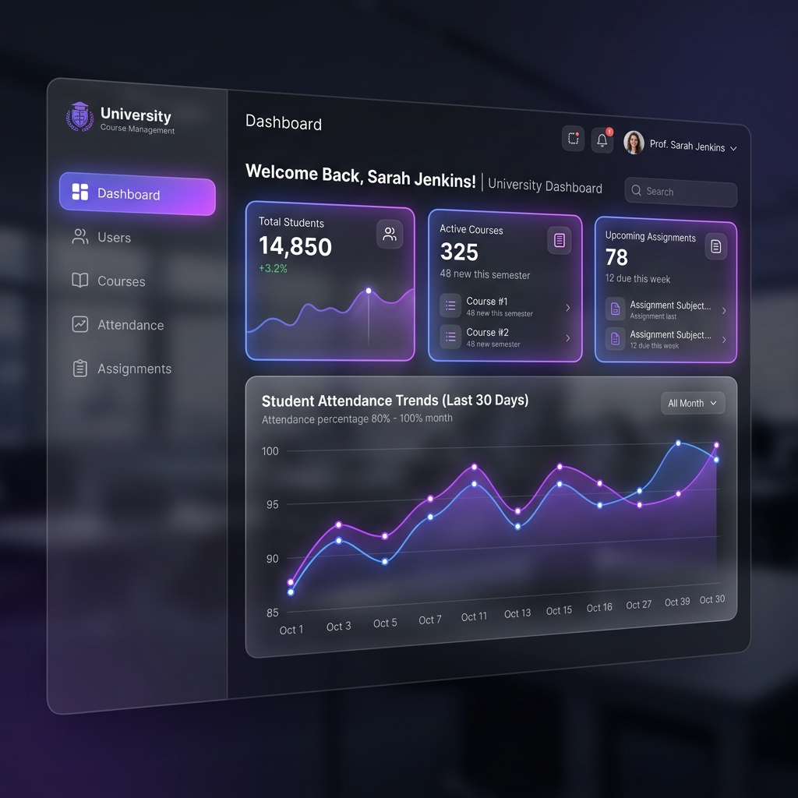

# 🎓 Course Management System (CMS)



A comprehensive, modern web application designed for educational institutions to manage courses, students, attendance, and assignments with a focus on user experience and security.

---

## 🚀 Introduction

The **Course Management System** is a robust platform built for administrators, instructors, and students. It streamlines academic workflows by providing a centralized hub for managing departments, course enrollments, attendance tracking, and assignment submissions. The interface is crafted with a **premium glassmorphism** design, offering a responsive and interactive experience across all devices.

---

## ✨ Features

- **🛡️ Secure Authentication**: Role-based access control (Super Admin, Admin, Instructor, Student).
- **🏫 Department Management**: Organize courses by academic departments.
- **📚 Course Catalog**: Create, edit, and manage comprehensive course details.
- **👥 User Management**: Manage student and instructor profiles with ease.
- **📅 Attendance System**: Real-time attendance marking and historical reporting.
- **📝 Assignment Workflow**: Instructors can create assignments; students can submit work for grading.
- **📊 Interactive Dashboard**: Visual statistics and quick-access cards for key metrics.
- **💻 Student Portal**: A dedicated area for students to track their progress and submissions.

---

## 🛠️ Tech Stack

- **Backend**: PHP 8.x (using PDO for secure database interactions).
- **Database**: MySQL / MariaDB.
- **Frontend**: HTML5, Vanilla CSS3 (Custom Design System), JavaScript (ES6+).
- **Design Style**: Glassmorphism, Modern Typography (Inter), Font Awesome Icons.
- **Security**: Password hashing (Bcrypt), session regeneration, and input sanitization.

---

## 📂 Project Structure

```text
course_mgt/
├── assets/             # Images, CSS, and JS files
├── config/             # Database connection and system settings
├── core/               # Core application logic and helper functions
├── includes/           # Reusable UI components (Sidebar, Navbar, Footer)
├── modules/            # Core feature modules
│   ├── assignments/    # Assignment creation and viewing
│   ├── attendance/     # Attendance marking and tracking
│   ├── courses/        # Course management
│   ├── departments/    # Department organization
│   ├── enrollment/     # Student-course enrollment logic
│   └── users/          # User and role management
├── student/            # Dedicated Student Portal application
├── uploads/            # Directory for assignment submissions
├── course_mgt.sql      # Database schema and seed data
├── index.php           # Main login portal
└── dashboard.php       # Admin/Instructor dashboard
```

---

## ⚙️ Installation & How to Use

### Prerequisites
- [XAMPP](https://www.apachefriends.org/) or any local server with PHP and MySQL.

### Setup Steps
1.  **Clone/Copy** the project into your `htdocs` directory.
2.  **Start Services**: Open XAMPP Control Panel and start Apache and MySQL.
3.  **Database Import**:
    - Go to `http://localhost/phpmyadmin`.
    - Create a new database named `course_mgt`.
    - Import the `course_mgt.sql` file located in the project root.
4.  **Configuration**:
    - Open `config/db.php` and verify the database credentials (default: host=`localhost`, user=`root`, password=``).
5.  **Access the App**:
    - Navigate to `http://localhost/course_mgt/` in your browser.

---

## 🔑 Default Credentials

Use the following credentials to explore the different roles in the system:

| Role | Username | Password |
| :--- | :--- | :--- |
| **Super Admin** | `admin` | `admin123` |
| **Instructor** | `instructor1` | `password123` |
| **Student** | `student1` | `student123` |

> [!NOTE]
> For security, it is highly recommended to change these passwords after the initial setup.

---

## 🔮 Future Integrations

- **📅 Calendar Integration**: Sync assignment deadlines with Google Calendar.
- **💬 Real-time Messaging**: Built-in chat system for student-instructor communication.
- **📄 PDF Reporting**: Generate automated attendance and grade reports in PDF format.
- **🔔 Notifications**: Email and browser push notifications for upcoming deadlines.

---

*Developed with ❤️ for Modern Education.*
